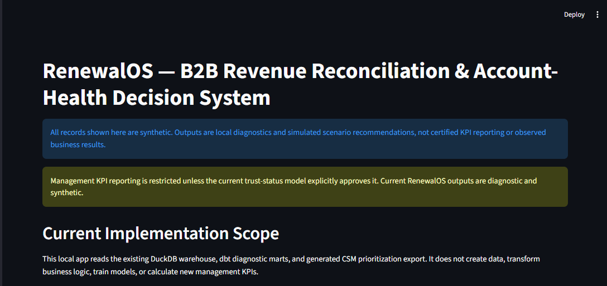
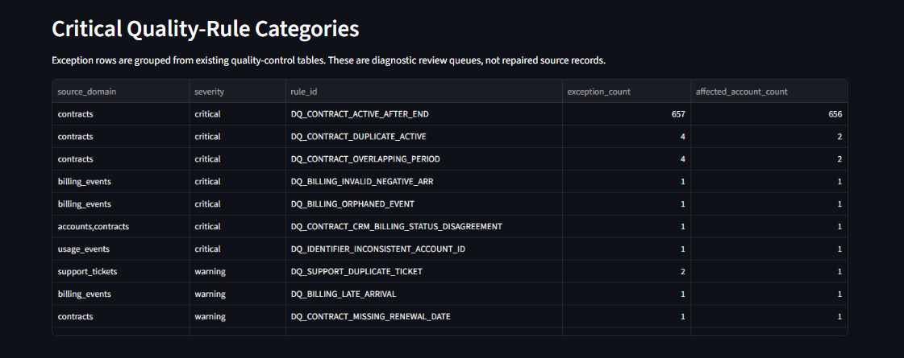

# RenewalOS

## B2B Revenue Reconciliation & Account-Health Decision System

RenewalOS is a synthetic portfolio project that designs a trustworthy analytics workflow for reconciling B2B revenue metrics and prioritizing Customer Success attention only after data quality is understood.

## Current Status

**Synthetic source-data, preliminary warehouse layers, diagnostic quality controls, account-health diagnostics, a capacity-constrained synthetic CSM prioritization layer, and a local Streamlit Control Tower implemented - no trusted management KPI reporting, machine-learning models, observed intervention outcomes, or business results yet.**

Raw synthetic source CSVs can be generated locally, but they intentionally include controlled data-quality incidents and are not trusted for KPI reporting. A local DuckDB and dbt warehouse layer can stage, preserve, and diagnose those records. The prioritization layer is scenario analysis over synthetic diagnostics only. No production deployment, machine-learning code, notebooks, Docker files, trusted KPI outputs, observed intervention outcomes, or business results have been created.

## Current Implementation Status

The repository now contains a Python package, local configuration paths, placeholder data directories, a local Streamlit Control Tower, CI configuration, a reproducible synthetic source-data generation layer, a local DuckDB + dbt warehouse layer, diagnostic data-quality and reconciliation controls, diagnostic account-health outputs, and a capacity-constrained synthetic CSM prioritization layer.

No trusted management KPI reporting, notebooks, machine-learning models, observed intervention outcomes, or business results are implemented.

## Interface Previews

The local Streamlit Control Tower is a reviewer-facing interface for synthetic diagnostic outputs.



Home page preview showing the project scope, synthetic-data disclaimer, and KPI reporting restrictions.



Data Trust preview showing traceable quality-control categories across contracts, billing, usage, and support.

The Streamlit app also includes account-health and CSM prioritization views. Prioritization outputs are simulated scenario recommendations, not trusted management KPIs, observed intervention outcomes, or business-impact results.

## Local Setup

This project targets Python 3.12.

```powershell
python -m pip install --upgrade pip
python -m pip install -e ".[dev]"
ruff check .
mypy src
pytest
```

## How To Reproduce Locally

Run the full local validation flow from the repository root:

```powershell
renewalos-generate-raw
renewalos-load-raw
cd dbt
dbt run
dbt test
cd ..
renewalos-run-prioritization
streamlit run app/app.py
ruff check .
mypy src
pytest
```

The generated CSVs, DuckDB database, dbt artifacts, caches, virtual environment files, and local app outputs are ignored by Git.

## Live Demo Deployment

For Streamlit Community Cloud, use `app/app.py` as the app entrypoint and `requirements.txt` as the dependency file.

On startup, the app checks for required generated demo artifacts: synthetic raw CSVs, the local DuckDB warehouse with required dbt outputs, and the simulated CSM prioritization export. If any are missing or invalid, it rebuilds the deterministic synthetic demo pipeline in this order: synthetic generation, raw load, dbt run, prioritization output, then Streamlit display. A startup lock and artifact checks prevent the pipeline from running repeatedly on normal Streamlit reruns.

All displayed records, diagnostics, assumptions, and recommendations remain synthetic and scenario-based. The live demo does not use real customer data, production systems, observed intervention outcomes, or production-ready management KPI reporting.

## What Makes This Project Different

- It treats data trust as the first product requirement, not as cleanup after metric reporting.
- It preserves quality blockers and reconciliation gaps instead of smoothing them away.
- It separates raw untrusted data, diagnostic evidence, health scoring, and scenario recommendations.
- It explains health and prioritization outputs with source lineage and explicit assumptions.
- It constrains CSM prioritization by simulated capacity and keeps excluded records visible.

## Synthetic Source Data

Generate reproducible raw synthetic source CSV files with:

```powershell
renewalos-generate-raw
```

The generator uses fixed seed `20260228` for a 24-month simulated B2B portfolio. The raw files are explicitly synthetic, include intentional quality incidents, and are not trusted for KPI reporting.

## Warehouse Architecture

RenewalOS uses a local DuckDB database plus dbt-duckdb models:

- `raw`: untrusted synthetic CSV values loaded without source-value alteration, with technical provenance metadata.
- `staging`: parsed and normalized views that preserve raw identifiers, raw values, incident markers, and parse/quality flags.
- `intermediate`: account-month, contract timeline, and billing movement layers that retain anomalies for review.
- `marts`: preliminary diagnostic account-month revenue and reconciliation views that are not approved for management reporting.

Run the local warehouse flow from the repository root:

```powershell
renewalos-generate-raw
renewalos-load-raw
cd dbt
dbt debug
dbt run
cd ..
```

The mart layer is preliminary. It exposes exception-ready fields and diagnostic differences, but trusted KPI reporting remains blocked until data-quality tests and reconciliation controls are satisfied.

## Data Quality and Reconciliation Controls

Run the current control flow from the repository root:

```powershell
renewalos-generate-raw
renewalos-load-raw
cd dbt
dbt run
dbt test
cd ..
renewalos-validate-quality
ruff check .
mypy src
pytest
```

The quality layer detects registered synthetic incidents, reports exception metadata, summarizes account-month quality status, and exposes preliminary reconciliation gaps. `mart_kpi_trust_status` provides a diagnostic gate for future revenue metrics, but management KPI reporting remains blocked in the current implementation. Raw files and diagnostic outputs include intentional quality incidents and must not be used directly for management KPI reporting.

## Account Health

Run the current diagnostic account-health flow from the repository root:

```powershell
renewalos-generate-raw
renewalos-load-raw
cd dbt
dbt run
dbt test
cd ..
renewalos-validate-quality
renewalos-validate-health
```

The account-health layer creates explainable synthetic account-month diagnostics from supported revenue, renewal, usage, support, Customer Success, and data-quality signals. It is not a predictive churn model, renewal-risk model, automated Customer Success prioritization system, or business-impact claim.

## Synthetic CSM Prioritization

Run the current synthetic prioritization flow from the repository root:

```powershell
renewalos-generate-raw
renewalos-load-raw
cd dbt
dbt run
dbt test
cd ..
renewalos-run-prioritization
```

The output is a capacity-constrained scenario analysis over synthetic account-health diagnostics. It includes intentional data-quality exclusions and simulated assumptions. It is not trusted KPI reporting, not an observed intervention result, and not a business-impact claim.

## Streamlit Control Tower

Build the local synthetic pipeline and start the app from the repository root:

```powershell
renewalos-generate-raw
renewalos-load-raw
cd dbt
dbt run
dbt test
cd ..
renewalos-run-prioritization
streamlit run app/app.py
```

The app can also initialize missing synthetic demo artifacts at startup for Streamlit Community Cloud. Generated CSVs, DuckDB files, dbt artifacts, and prioritization exports remain ignored by Git.

Implemented pages:

- **Landing page:** implementation scope, synthetic-data disclaimer, data-readiness warning, and navigation guidance.
- **Data Trust:** KPI gate status, quality statuses, exception categories, and incident detection coverage.
- **Revenue Reconciliation:** diagnostic reconciliation statuses, gaps, filters, and account-month evidence.
- **Account Health:** assessment coverage, eligible versus blocked records, health bands, and explanation drivers.
- **CSM Prioritization:** simulated scenario assumptions, eligibility/exclusions, capacity usage, recommendations, and CSV export.
- **Methodology:** documentation map and limitations.

All app outputs are synthetic diagnostics or simulated scenario recommendations. They must not be treated as trusted management KPIs, real customer evidence, observed intervention outcomes, or business-impact results.

## Business Problem

B2B companies often use ARR, NRR, churn, renewal, and account-health metrics to make Sales, Customer Success, Finance, and management decisions. Those decisions become risky when source systems disagree, revenue movements do not reconcile, account records are incomplete, or risk indicators are unreliable.

RenewalOS is designed to show how an analytics engineering project can make those risks visible before operational decisions are made.

## Project Questions

1. Can the company trust its ARR, NRR, churn, and renewal metrics?
2. Which data-quality issues could distort management decisions?
3. Which accounts should a limited Customer Success team prioritize once the data is trustworthy?

## Architecture Summary

The current architecture includes simulated source domains, validation checks, reconciliation diagnostics, account-health diagnostics, capacity-constrained prioritization, and decision-policy documentation.

Implemented components:

- Synthetic source data representing CRM accounts, contracts, billing or subscription events, usage activity, support tickets, Customer Success interactions, and optional operational incidents.
- Data-quality checks that detect known failure scenarios before KPI reporting or prioritization.
- Revenue reconciliation logic that explains ARR movement from opening ARR to closing ARR.
- Metric definitions that distinguish management KPIs from diagnostic KPIs.
- Account-health decision rules that combine revenue at risk, renewal timing, health deterioration, and intervention capacity.
- Documentation that keeps assumptions, limitations, and synthetic-data labels visible.

## Synthetic-Data Disclaimer

This is a synthetic public portfolio project only. It does not use real customer data, real company schemas, proprietary business logic, or internal systems. All future metrics, examples, source systems, incidents, and analysis outputs must be explicitly labelled as simulated.

The project must not mention unrelated real companies, imply access to internal systems, or present fabricated business impact, model accuracy, screenshots, or completed analysis.

## Possible Future Stages

1. Extend metric definitions into governed KPI transformations only after trust gates support them.
2. Add broader quality scenarios if new source-domain risks are documented.
3. Refine account-health assumptions with clearly labelled scenario versions.
4. Review and extend prioritization logic only with clearly labelled scenario assumptions.
5. Document limitations, validation findings, and next analytical questions.
